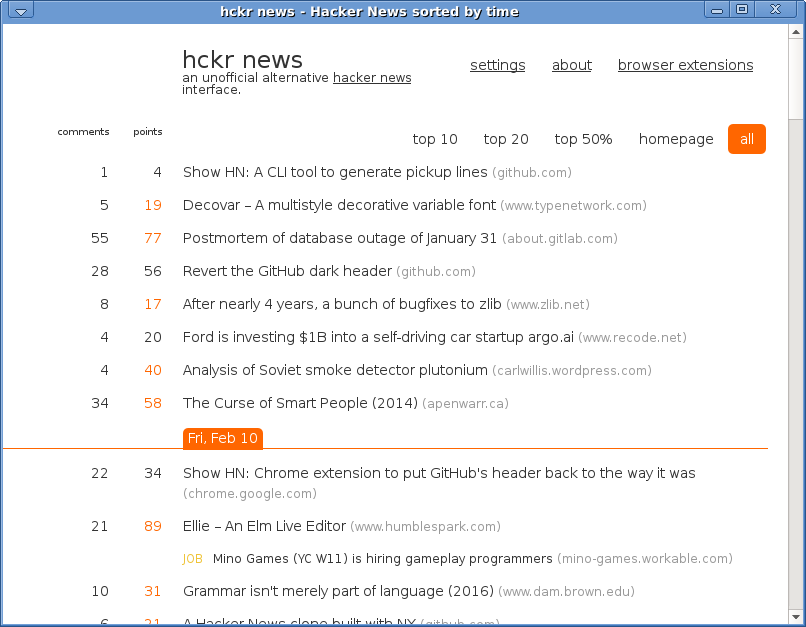

# Run webapps from the desktop

Display any website as web app using the Qt5.
No toolbar, navigation bar, bookmarks bar. <i>Just the app and title!</i>

Run using:
<pre>
qt5webview.py -u https://hckrnews.com/
qt5webview.py -u https://ventusky.com
qt5webview.py -u https://arstechnica.com --nojavascript
</pre>

# Add a desktop icon 

Example launcher on XFCE Desktop:
<pre>
[Desktop Entry]
Version=1.0
Type=Application
Name=HN
Exec=qt5webview.py -u https://hckrnews.com/
Icon=/usr/share/icons/webapps/hn.png
Terminal=false
StartupNotify=false
Name[en_US]=HNews
</pre>
